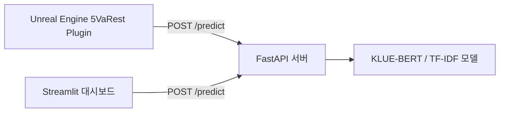

# 🕊️ The Negotiator — 감정 AI 기반 협상 롤플레이 게임

> 극한 상황에 놓인 NPC를 3턴 안에 설득하라.
> 당신의 말 한마디가 AI의 감정을 실시간으로 움직입니다.

 

## 📌 프로젝트 소개

**The Negotiator**는 AIHUB 감성대화말뭉치(약 27만 건)를 학습한 한국어 감정 분류 AI를
Unreal Engine 5 게임에 실시간으로 연동한 인터랙티브 협상 롤플레이 게임입니다.

플레이어는 위기 상황에 처한 NPC와 대화하는 협상가 역할을 맡습니다.
입력하는 모든 문장은 FastAPI 서버를 거쳐 AI가 실시간으로 감정을 분석하고,
그 결과는 NPC의 감정 게이지(분노 / 기쁨)에 즉각 반영됩니다.
3턴 안에 NPC를 설득하지 못하면 협상은 실패합니다.

단순한 감정 분류 데모가 아니라, **하나의 AI 엔진을 Unreal Engine 게임 클라이언트와
Streamlit 웹 대시보드가 동시에 공유하는 API 기반 플랫폼**으로 설계했습니다.

 

## 🎯 핵심 기능

| 기능 | 설명 |
|---|---|
| 실시간 감정 분석 | 플레이어 입력 문장을 FastAPI 서버가 즉시 분석하여 감정 반환 |
| 감정 게이지 시스템 | 분노 / 기쁨 게이지가 대화 내용에 따라 실시간으로 변화 |
| 턴제 협상 구조 | 3턴 안에 설득에 성공해야 하는 긴장감 있는 게임 루프 |
| XAI 키워드 하이라이팅 | AI가 어떤 단어를 근거로 감정을 판단했는지 시각적으로 제시 |
| 멀티 클라이언트 플랫폼 | Unreal Engine과 Streamlit이 동일한 API 서버를 공유하는 구조 |

 

## 🧠 AI 모델

두 가지 모델을 학습하고 성능을 비교하여 최적 모델을 서비스에 적용했습니다.

| 모델 | Accuracy | F1-Score |
|---|---|---|
| TF-IDF + Logistic Regression | 0.75 | 0.60 |
| **KLUE-BERT (Fine-tuned)** | **0.81** | **0.68** |

데이터셋: [AIHUB 감성대화말뭉치](https://aihub.or.kr/aihubdata/data/view.do?currMenu=115&topMenu=100&aihubDataSe=data&dataSetSn=86) (분노 · 불안 · 당황 · 슬픔 · 상처 · 기쁨, 약 27만 건)

 

## 🏗️ 시스템 아키텍처

Unreal Engine과 Streamlit은 동일한 FastAPI 서버에 요청을 보내고
동일한 JSON 응답 구조(`emotion`)를 받는 대칭 구조로 설계했습니다.

 

## 🛠️ 기술 스택

**AI / Data**
`Python` `scikit-learn` `PyTorch` `HuggingFace Transformers` `KLUE-BERT` `TF-IDF + Logistic Regression`

**Back-end**
`FastAPI` `Streamlit`

**Game Client**
`Unreal Engine 5` `VaRest Plugin` `Blueprint`

**Deploy**
`HuggingFace Spaces`

 

## 👥 팀원 및 역할

| 이름 | 역할 |
|---|---|
| 이경준(PM) | Unreal Engine — 게임 클라이언트, VaRest 연동, UI/UX 구현, 게임 로직 |
| 김동훈 | AI / Data — 데이터 전처리, 모델 학습 및 성능 비교, XAI 모듈 |
| 이유찬 | Back-end — FastAPI 서버, Streamlit 대시보드, 배포 |

 

## 📸 데모

시연 영상
[https://youtu.be/n7g_PxMKc44]

 

## 🔗 링크

- 라이브 데모: [https://huggingface.co/spaces/rudwns67/streamlit-UI]
- 노션: [https://app.notion.com/p/The-Negotiator-a24a0e7b4c2183f8806301875debd87b?source=copy_link]
